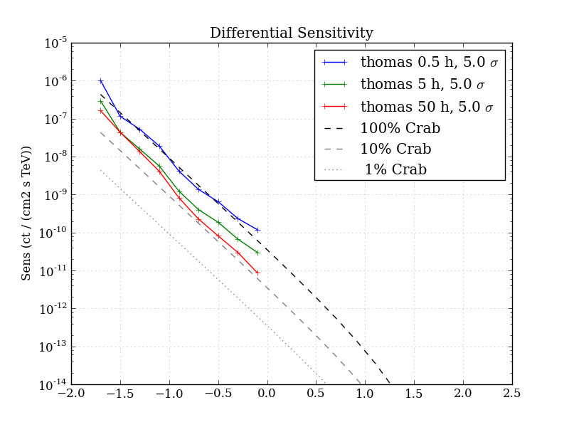
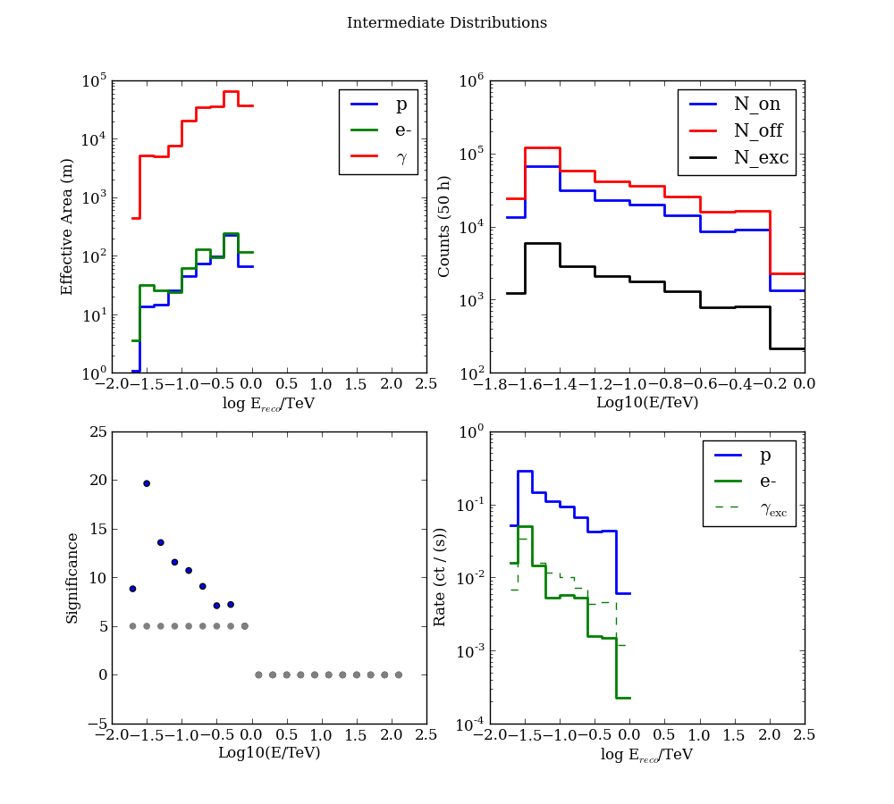
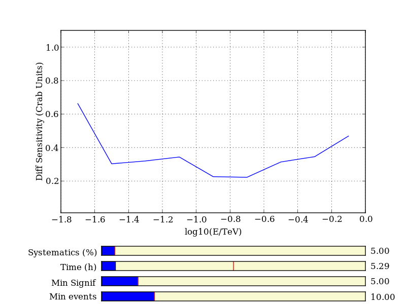

.. Sensitivity documentation master file, created by
   sphinx-quickstart on Thu Jul  4 11:57:21 2013.
   You can adapt this file completely to your liking, but it should at least
   contain the root `toctree` directive.

Sensitivity Calculation for Ground-based Gamma-Ray Instruments
==============================================================

This is a collection of python code used to generate sensitivity
curves (and other related products) for Gamma-Ray telescopes from
simple Monte-Carlo input data.

The code is broken into several modules:

.. toctree::
   :maxdepth: 1

   sensitivity
   inputs
   spectra
   format
      
Input Data
----------

To standardize the calculation of sensitivity curves, and to minimize
the number of different assumptions that can go into the calculation,
the input data has been standardized as much as possible, and contains
only the minimal information needed to derive a sensitivity, such as
count distributions. 

The FITS format is documented in the :doc:`format` section, and a
converter tool is provided for ROOT files

Example
-------
The following figures are generated by the example code shown below:

   a differential sensitivity plot

     
   example of intermediate debugging plots

.. literalinclude:: ../Examples/calcsens.py

Code is also included to produce an interactive display, so that one
can play with the parameters of the data and see how the sensitivity
curve changes. 

   
   example of an interactive sensitivity plot (with realtime controls)

Indices and tables
==================

* :ref:`genindex`
* :ref:`modindex`
* :ref:`search`

